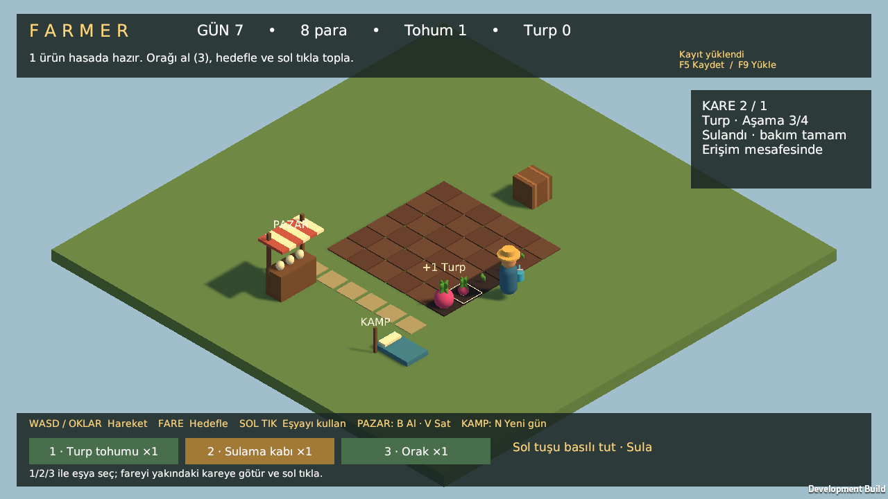
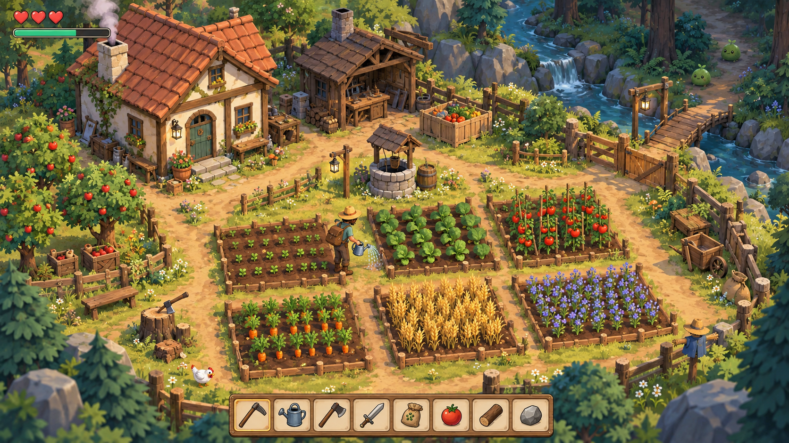

# Farmer

Çalışma adı: **Farmer**. Sabit açılı izometrik kamerayla oynanan, stilize 3D çiftçilik, üs kurma ve hafif keşif/savaş oyunu.

**Unity 6000.3.25f1 LTS + C# + URP** kurulumu doğrulandı. İlk import, C# derlemesi, izometrik başlangıç sahnesi ve Linux geliştirme build'i başarılı. Build çalıştırılıp gerçek ekran görüntüsü incelendi. 0.1 çekirdek döngüsü hazır: hareket, 6×6 tarla, tohum satın alma, ekim/sulama, dört büyüme aşaması, hasat/satış ve kayıt/yükleme.

## Oyna

`Assets/_Farmer/Scenes/Farm.unity` sahnesini Unity'de açıp Play'e bas. Bu makinede hazır Linux uygulaması `builds/Linux/Farmer.x86_64`; build çıktısı Git'e girmez.

- **WASD / ok tuşları:** hareket.
- **Fare:** tarla karesini hedefle; tıklamana gerek yok. Turuncu çerçeve, yaklaşman gerektiğini belirtir.
- **1 / 2 / 3:** tohum / sulama kabı / orak kuşan. Eşya çubuğuna tıklayarak da seçebilirsin.
- **Sol tık:** tohum ek veya orakla hasat et.
- **Sulama kabıyla sol tuşu basılı tut:** fareyi yakındaki tarla karelerinde gezdirerek sula. Sulama boyunca hafif su sesi çalar; tuşu bırakınca yaklaşık 0,7 saniyede azalarak biter.
- **Pazar yakınında B:** 1 tohum al. **V:** turpların hepsini sat. Ekrandan 5 tohum da alınabilir.
- **Kamp yakınında N:** günü bitir. Bir kez sulanan ürünler büyür; hiç sulanmayanlar bekler.
- **F5 / F9:** kaydet / son kaydı yükle. Başarılı işlemler zaten otomatik kaydedilir.

Sulama kabı ve orak başlangıç eşyalarıdır; kullanıldıkça tükenmez. Tohum sayısı satın alma/ekimle değişir. Elindeki eşya da kaydedilir.

Karakter, aletler ve çevre geçici geometrilerdir. İlk ürün turptur: tohum 10, satış 18 para; ekimden sonra bir kez sulanır ve üç gece sonra hasat edilir. Gerçek zamanlı bekleme yoktur. Sıradaki sürüm 0.2 modüler üs kurmadır. [Testler ve manuel kontrol](docs/TESTLER.md).

## Başlangıç

- [Unity kurulumu ve açılış adımları](docs/KURULUM.md)

- [Yazılımcı ve oturum devir notu](YAZILIMCI.md)
- [Oturum çalışma talimatları](AGENTS.md)
- [Oyun tasarımı](docs/OYUN_TASARIMI.md)
- [Sürüm planı](docs/YOL_HARITASI.md)
- [Motor değerlendirmesi](docs/MOTOR_KARARI.md)
- [Görsel dil ve model promptları](docs/VARLIK_REHBERI.md)

## Görsel hedef

Bu görsel konsepttir; çalışan oyunun ekran görüntüsü değildir. Üçüncü şahıs konsepti de [görsel referans](docs/references/farm_third_person_concept.png) olarak saklanır; kamera kararı izometriktir.

## İki bilgisayarda çalışma

Diğer bilgisayarda [cenkgrs/Farmer](https://github.com/cenkgrs/Farmer) deposunu klonla ve proje kökünü aç. Sonraki oturumlarda temiz çalışma ağacında ilgili dalı `git pull --ff-only` ile güncelle. Codex proje talimatları `AGENTS.md` içindedir; kısa bir “Kaldığımız yerden devam et” isteğiyle proje notları okunarak devam edilebilir.

Normal devirde kodla birlikte devir notları da commit/push edilir. **İlk push 6 Ekim 2026 tarihinde kullanıcının isteğiyle tamamlandı; `main` dalı `origin/main` izliyor.** Diğer bilgisayar yalnızca uzak depoya gönderilmiş dosya ve commitleri alır; yerel sohbet, kurulu motor ve kaydedilmemiş işler Git ile aktarılmaz.

`origin`: `https://github.com/cenkgrs/Farmer.git`. Remote erişimi doğrulandı; özel `cenkgrs/Farmer` deposu ilk push öncesinde boştu. Yalnızca bu depoda Git kimliği `Cenk Gürses <cenkgrs@gmail.com>` olarak ayarlandı. Proje açılış ve lisans sonrası doğrulama adımları kurulum rehberinde.

[AGENTS.md talimatlarının keşfi — resmi belge](https://learn.chatgpt.com/docs/agent-configuration/agents-md)
