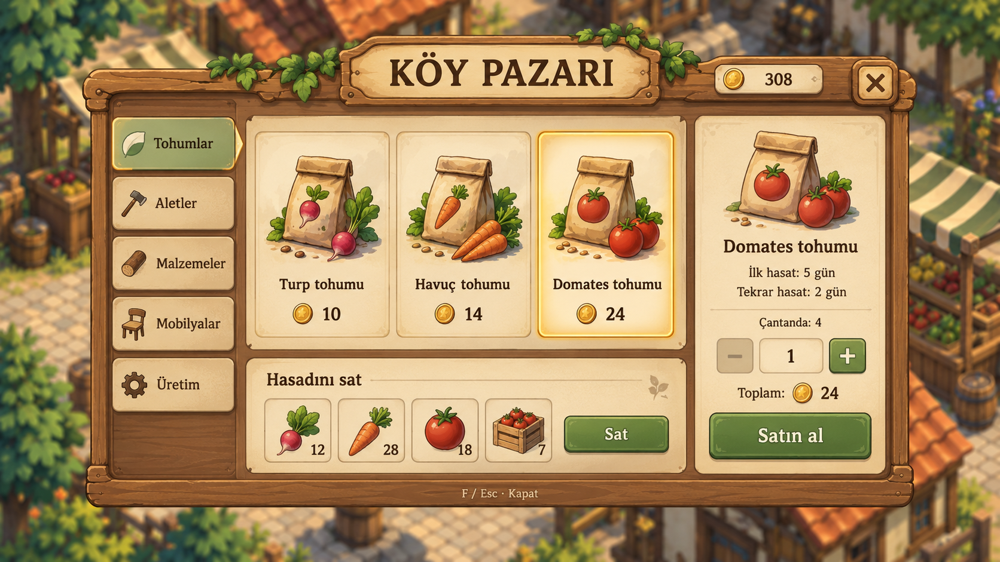

# Köy pazarı — arayüz eskizi v01

**Durum: kullanıcı değerlendirmesine sunulan konsept; oyuna uygulanmadı.**
Kullanıcı beğenirse mevcut pazar arayüzü bu tasarıma dönüştürülecek.

Ahşap çerçeve ve krem paneller; solda kategori seçimi, ortada ürün kartları,
sağda seçilen ürünün açıklaması/adedi/satın alma işlemi, altta satış bölümü.
Tohum, alet, malzeme, mobilya ve üretim mevcut oyun kapsamını temsil eder.
Görseldeki cüzdan ve çanta adetleri örnektir; satış şeridindeki sayılar fiyat
değildir. Oyun ekonomisi değişmedi. Adet seçici ve yeni düzen henüz uygulanmadı.

Yerleşik ImageGen ile üretildi. Referanslar: `docs/screenshots/crop-market.png`
ve `docs/references/farm_isometric_concept.png`. Kullanılan tam [prompt](prompt.txt)
saklandı. Türkçe başlıklar, fiyatlar ve öğe düzeni görsel olarak incelendi.
PNG, tasarım referansıdır; kesilip oyuna hazır UI sprite seti değildir.

Bu eskizden bağımsız uygulanan davranış: pazara yaklaşınca yalnız F ipucu
görünür, F paneli açar; F/Esc/× kapatır. Genel bağlamsal etkileşim tuşu F'dir;
kapı/sandık da F kullanır. Panel açıkken hareket ve dünya eylemleri engellenir.
